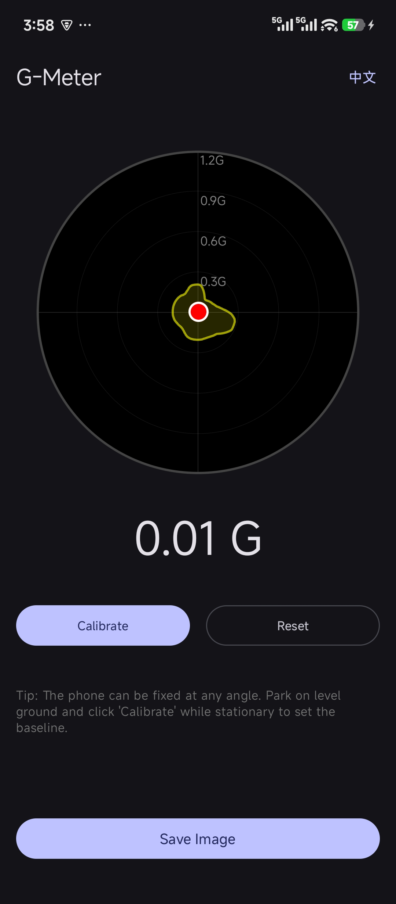

# GMeter - Automotive G-Force Performance Meter
# GMeter - 汽车 G 力性能测试仪

GMeter is a specialized Android application designed for car enthusiasts to monitor and record vehicle G-force performance in real-time. It provides a visual "Performance Envelope" to help you understand your car's handling limits.

GMeter 是一款专为汽车爱好者设计的 Android 应用，用于实时监测和记录车辆的 G 力表现。它通过直观的“性能包络图”帮助你了解车辆的操控极限。

## Features | 功能特点

- **Real-time G-Force Monitoring**: High-precision tracking of lateral and longitudinal G-forces.
- **Performance Envelope**: Automatically records and smooths historical maximum G-forces to draw a performance boundary.
- **Any-Angle Calibration**: Supports fixing the phone at any orientation; simply click "Calibrate" on level ground to set the baseline.
- **Car-Optimized Range**: 1.2G display range, perfectly suited for passenger car performance testing.
- **Save to Gallery**: Export your performance envelope diagram with peak values to your photo gallery.
- **Bilingual Support**: Full support for both English and Simplified Chinese.

- **实时 G 力监测**：高精度追踪纵向和横向 G 力。
- **性能包络图**：自动记录并平滑处理历史最大 G 值，绘制出车辆的操控边界。
- **任意角度校准**：支持手机以任何角度固定；只需在水平地面静止时点击“校准”即可设定基准。
- **针对汽车优化**：1.2G 显示量程，完美契合乘用车性能测试。
- **保存到相册**：将包含峰值数据的性能包络图导出到手机相册。
- **双语支持**：完整支持英文和简体中文。

## Technical Stack | 技术栈

- **Language**: Kotlin
- **UI Framework**: Jetpack Compose
- **Sensors**: Android Sensor Manager (Linear Acceleration & Gravity)
- **Graphics**: Compose Canvas & Android Graphics Path

## How to Use | 如何使用

1. Fix your phone securely in your car (at any angle).
2. Park on a level surface while the vehicle is stationary.
3. Open GMeter and click **"Calibrate"**.
4. Start driving! The red dot shows real-time G-force, and the yellow area tracks your maximum performance.
5. Click **"Save Image"** to export your results.

1. 将手机稳固地固定在车内（任何角度均可）。
2. 在水平地面停车并保持车辆静止。
3. 打开 GMeter，点击**“校准”**。
4. 开始驾驶！红点显示实时 G 力，黄色区域记录你的最大性能表现。
5. 点击**“保存图片”**导出测试结果。

## License | 许可

This project is licensed under the GNU General Public License v3.0 (GPL-3.0).
本项目采用 GNU 通用公共许可证 v3.0 (GPL-3.0)。
